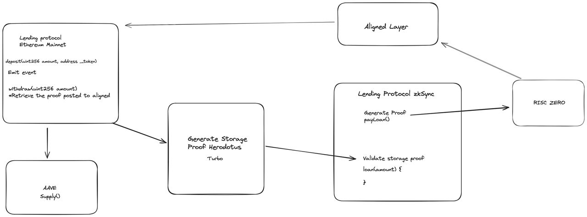
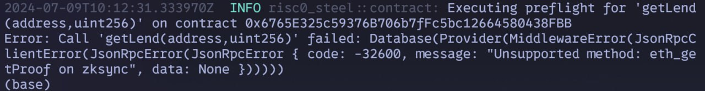

# Yo Te Presto Protocol (YTP Protocol)

## Problem

Currently, there is an issue with fragmented liquidity affecting both the user and the protocol. This problem will continue to grow as the number of rollup options increases. Additionally, there is a security concern for users when using bridges, where assets are merely locked on one chain and "created" on another (mint & burn).

## Our Solution

We are creating a lending protocol that generates storage proofs of users' collateral deposits. These proofs can be validated on any Layer 2 (L2) network, enabling users to receive a loan of up to 80% of the value of their collateral.
This approach improves the user experience and eliminates the need for potentially hackable bridges.

## How We Do



We are using [Herodotus - Turbo](https://docs.herodotus.dev/herodotus-docs/developers/turbo) in our [CollateralDepositProof Contract](./ytp_foundry/src/CollateralDepositProof.sol) that is deployed on ZkSync to check if the user that want to receive a loan makes a deposit on L1
if this proof is valid We give funds to the user.

When the user wants to recover their assets on Ethereum, they repay their loan. We generate a proof with [Risc Zero](https://www.risczero.com/get-started) that the user has completed the repayment, and post it to [Aligned](https://docs.alignedlayer.com/) for validation. This allows the assets to be recovered on the Ethereum mainnet.

## Details

[zkSync Sepolia Contract](https://sepolia.explorer.zksync.io/address/0x8F04b1Bc12B8FEE3Bd748E035020cD21CBb691E9#contract)

<https://sepolia.explorer.zksync.io/address/0xd101F46B9532183c8E54bd22eAdFe8A48De8C08D>

[Ethereum Sepolia Contract](https://sepolia.etherscan.io/tx/0xcfa746e8fd5040d4a8d20ba2be34fa69dc6e53f9a306a8dff922e849d54fcfc8)

Execute proof:

```curl
cd ZKProofs/repay-proof-RPC-SEPOLIA
RPC_URL=https://eth-sepolia.g.alchemy.com/v2/dhPay_DP_SCx1clkQQD9iJcSNQ0hC_1n  RUST_LOG=info BONSAI_API_KEY=H8MPWMtRlY6TwKU9Jom7u8OSjWk8j08G2eCOCSJ0 BONSAI_API_URL=https://api.bonsai.xyz/   cargo run --release
```

**Because zkSync Sepolia give us this error:



We have to use Ethereum Spolia
